# Lab Report 3
### Streamlining ssh Configuration

This option is to create a config file to allow a more simpler command to be used to login into the ieng6 server, without the need to type out the entire line of username@ieng6.ucsd.edu to login.

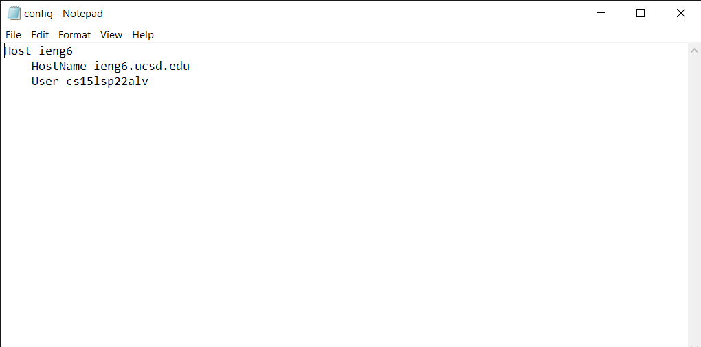

First is to create a file and to use a text editor to edit it, in my case I used Notepad to edit this text file, on the image above is the line of coding used to allow for a login.

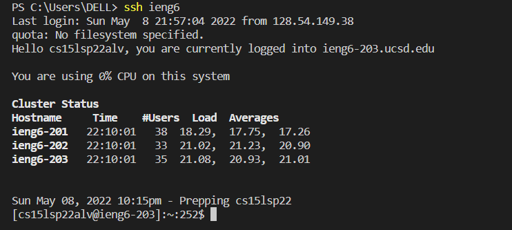

This image is demonstrating how to login and how simpler it is with the host name.

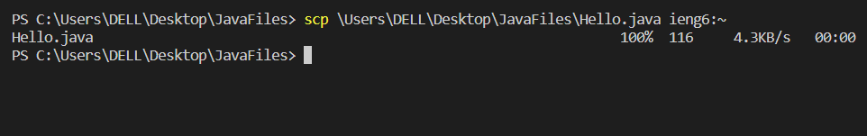

This image is showing how now commands with ssh or scp can also use the ssh config to login easely with commands, without the need to type out the entire username@ieng6.ucsd.edu.

### Setup Github Access from ieng6

This option is to show how to access Github from the remote server bt git commands, using **_git commit_** and **_git push_** to push changes to the remote server through the usage of a token authentication.

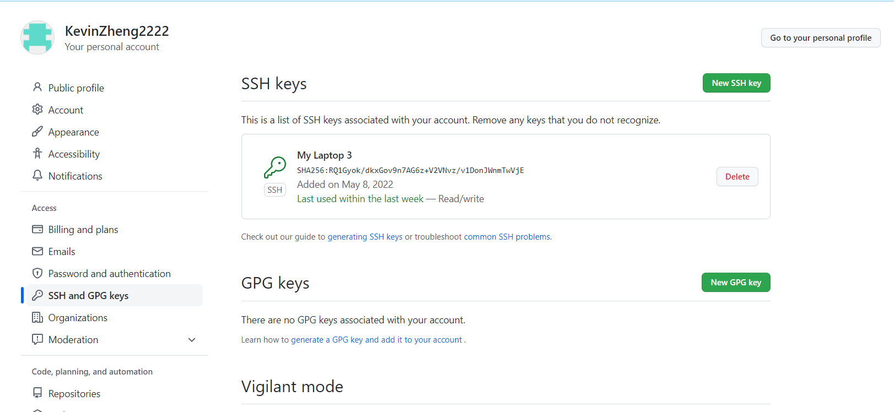

The image above shows where to place the SSH keys to allow your git account to know you are accessing from your remote account to cimmit changes.

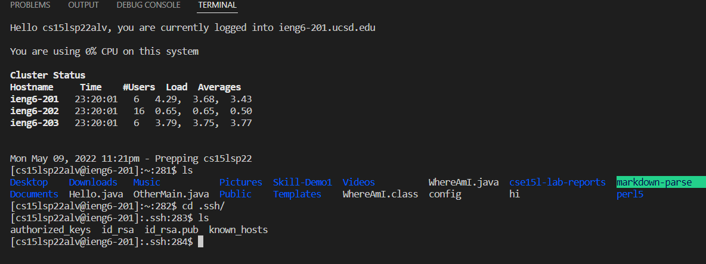

The image above shows where the private key is stored in your account and it is the file id_rsa.

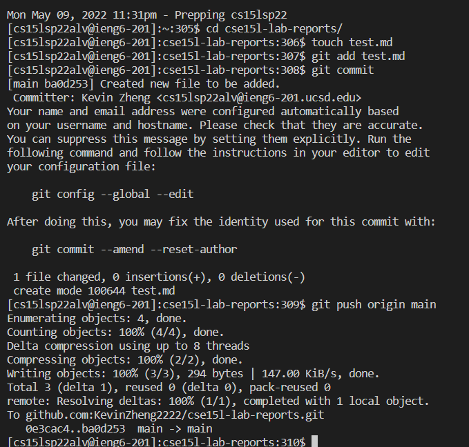

The image above shows the usage of the commands **_git commit_** and **_git push_** to commit a change on from the remote server and pushing it onto Github.

This is the link to the [commit](https://github.com/KevinZheng2222/cse15l-lab-reports/commit/ba0d253588b09c0c42e2fb6f357f5c7b44844d8b) shown above.

### Copy whole directories with scp -r

This option is to show how to copy an entire directory from the local machine to the remote server through the command:

>scp -r . ieng6:filename/

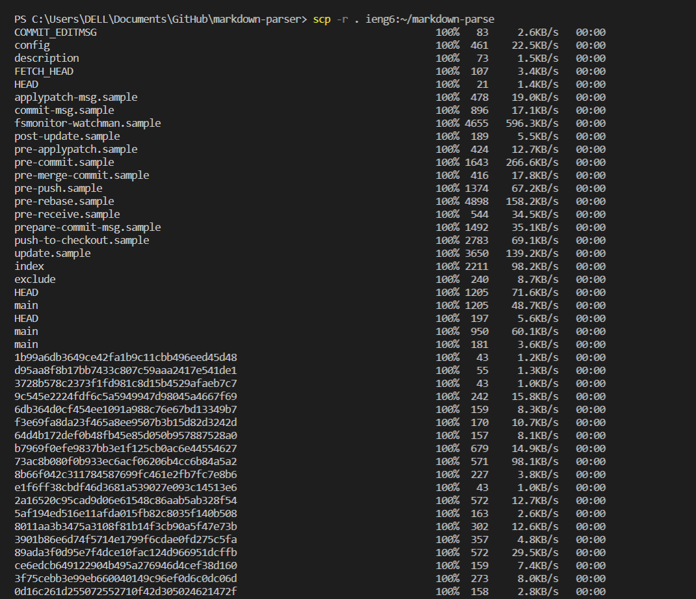
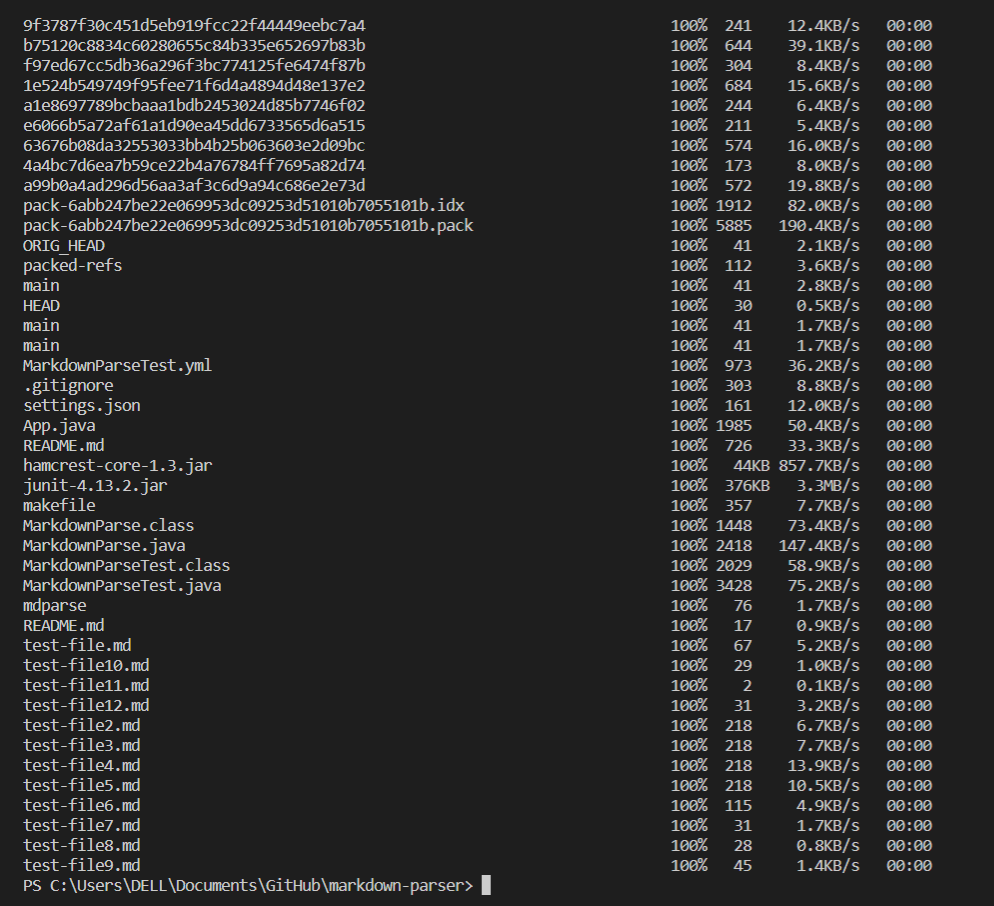
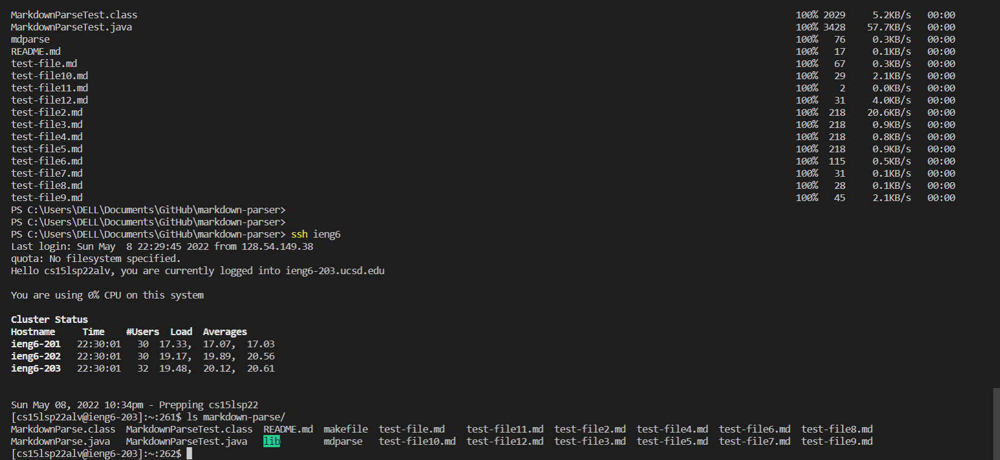

The images above is an example of the usage of **_scp -r . ieng6:filename/_**
on the following repository **markdown-parse** and copying it into the remote server from the local machine.

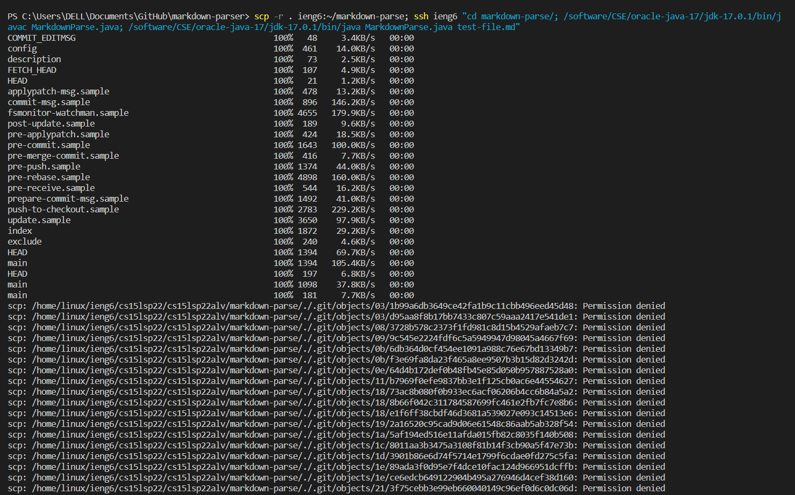
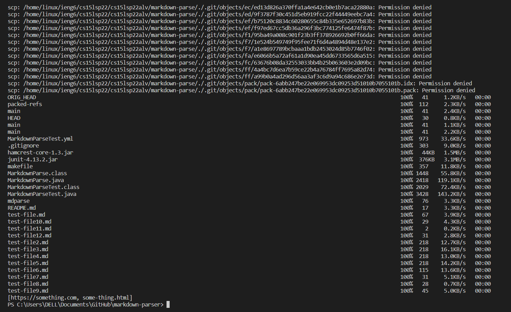

The following images above is a example of the usage of the code **_scp -r . ieng6:filename/_** with other combination of codes to run altogether at the same time and using the login from ssh configuration to login onto the server to run those commands.