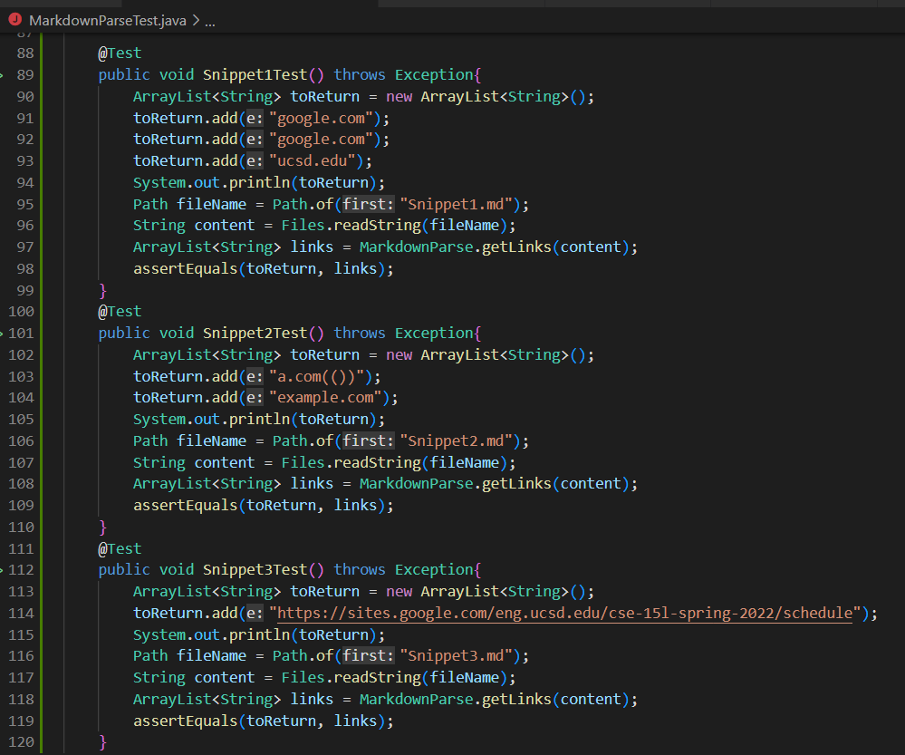
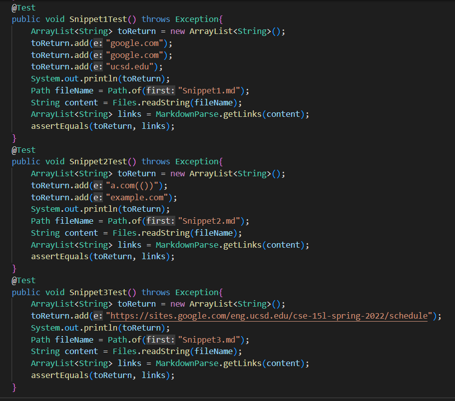
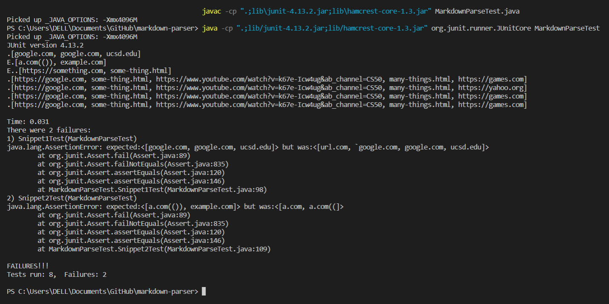
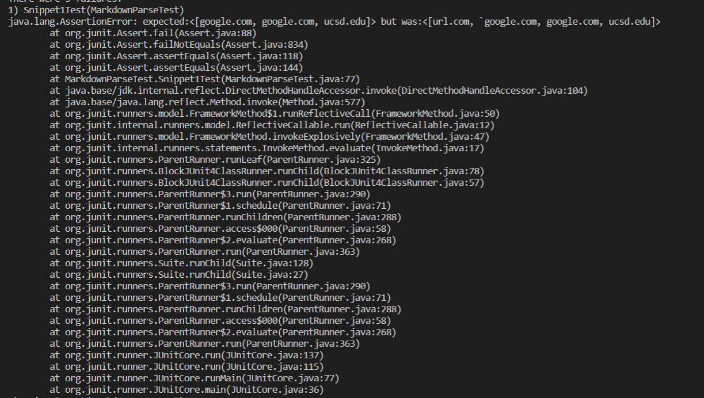
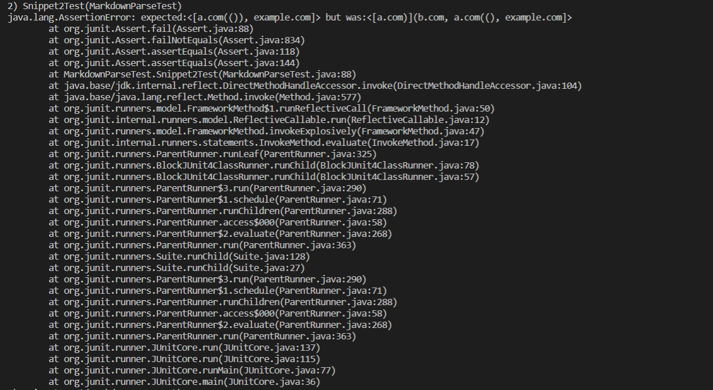
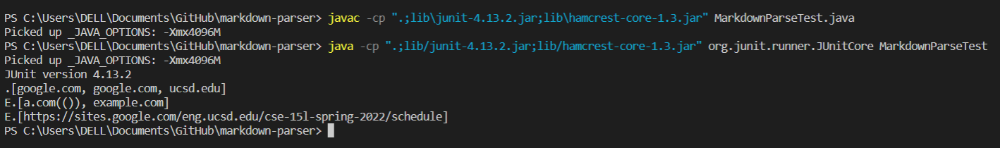
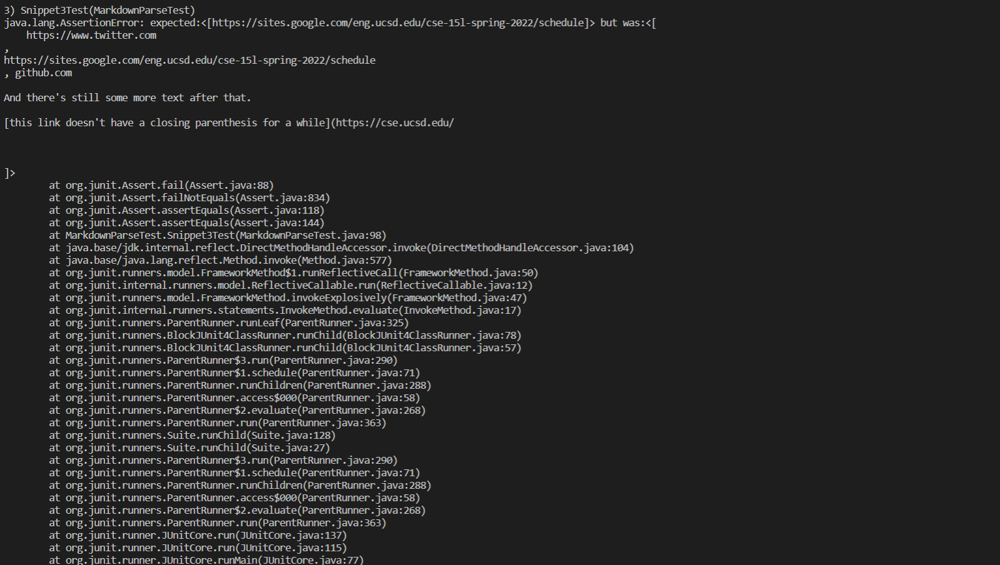
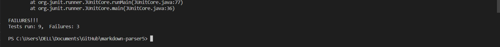

# Lab Report 4
### Repositories

[My group MarkdownParse](https://github.com/Shresthhooda/markdown-parser)

[Review group MarkdownParse](https://github.com/alixintong/markdown-parser)

### Test Implementation
Test are implemented on MarkdownParseTest.java.

This is the implementation of test cases on my groups.

This is the implementation of test cases on the one being reviewed.

### Snippet 1

On both ours and the review MarkdownParse, both did not succeed the test cases. The test cases are created through the usage of VSCode preview.

This is the implementation of Snippet 1 on my groups MarkdownParse which failed.

This is the implementation of Snippet 1 on the review groups MarkdownParse which failed.

### Snippet 2

On both ours and the review MarkdownParse, both did not succeed the test cases. The test cases are created through the usage of VSCode preview.

This is the implementation of Snippet 2 on my groups MarkdownParse which failed.

This is the implementation of Snippet 2 on the review groups MarkdownParse which failed.

### Snippet 3

On both ours and the review MarkdownParse, both did not succeed the test cases. The test cases are created through the usage of VSCode preview.

This is the implementation of Snippet 3 on my groups MarkdownParse which failed. This failure was because it caused a infinite loop in the coding, thus this resulting in seperating Snippet 3 test case from the other two Snippets to allow the other two snippets to run through JUnit, while Snippet 3 was later added to wun to show a infinite loop.

This is the implementation of Snippet 3 on the review groups MarkdownParse which failed.

## Changes to Snippets

### Snippet 1

For Snippet 1 I belive there is a way for our code to not read backticks, as we already implemented some coding to read what if there is space between brackets and paranthesis and so on. So for this change for our code to be able to read a backticks, it will have to be implemented before the first open braket is read and after the back bracket. Thus, this code change might take about 4-5 lines of coding to allow for change.

### Snippet 1

For Snippet 2 I belive it might require a more on hand change because we have some coding that reads what happens if there is extra parenthesis or brackets and it skips that line. Furthermore, we will have to add more code to read any link inside another braket, thsu leading to a more involve coding. 

### Snippet 1

For Snippet 3 I belive it might require a more involve coding because our MarkdownParse cannot handle a extra empty line after the parenthesis. Furthermore, through the VSCode preview it showed that one of the links worked and the format after using our MarkdownParse it printed out the link in a incorrect format, thus this leads to more coding and more implementation leading to a more involve coding.