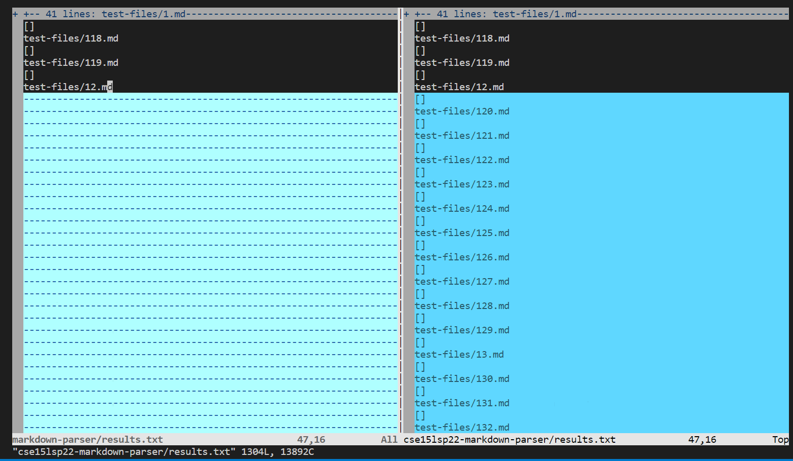
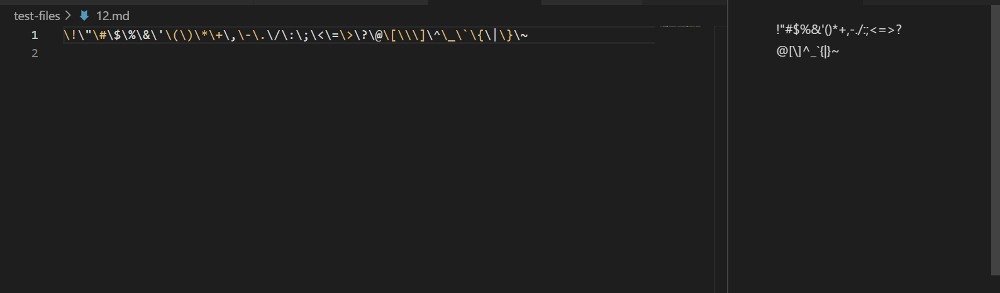
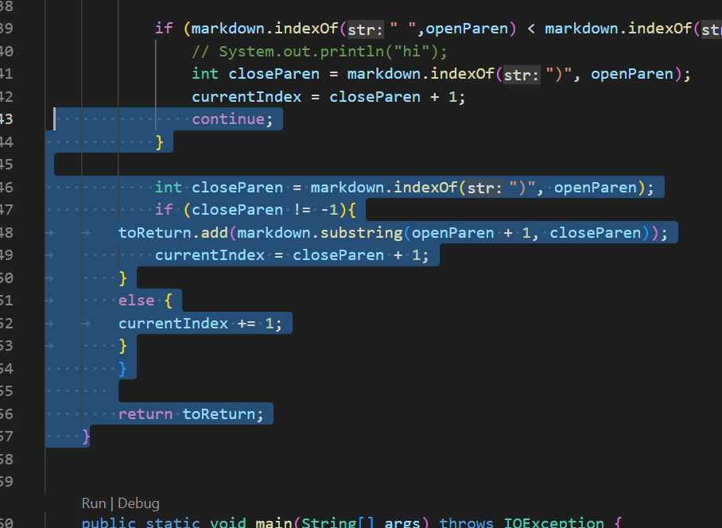
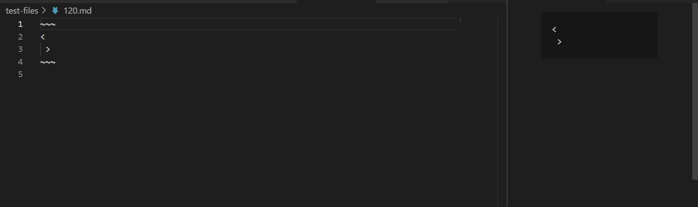

## Lab Report 5

The following two test cases are found through the usage of vimdiff on the terminal to find their different outputs. The difference is shown through the highlight of light blue indicating a difference.

Here is how it looks like on the terminal:

Our program, on the left, only allowed the bash script to run till file test 12 before it ran into an infinite loop not allowing us to finish the rest of the testing.

### Test 12

To find the result on this text I used the preview on VSCode to see what I should get on this particular test and then see the actual result from using getLinks to see what it actually returns.

Here is how the preview looks like:

There should not be any links within this test because on the preview as shown it indicates no link is being hidden, and in the raw source code no link structure is being used to create a link.

 This is shown below that there is no link in test 12 on the right, thus resulting in an empty array:

Meanwhile in our coding it resulted in a infinite loop as shown above in the image to the left. This is caused by our code not finding the ending of a ).

Shown below:

In the image above the highlighted part of the coding is the part in which I have to fix. To fix it I will have to implement a way to continue reading the file after there is no more ). Otherwise it will continue to cause a infinite loop in other test cases that does not end with the last letter as ).

### Test 120

To find the result on this text I used the preview on VSCode to see what I should get on this particular test and then see the actual result from using getLinks to see what it actually returns.

Here is how the preview looks like:

There should not be any links within this test because on the preview as shown it indicates no link is being hidden, and insteaed is showing a code block that has nothing but arrows in it. Furthermore, in the raw source code no link structure is being used to create a link.

 This is shown below that there is no link in test 120 on the right, thus resulting in an empty array:

Meanwhile in our coding it never shown a result because of a infinite loop caused on test 12 stopping the entire test cases, as shown above in the image to the left. This is caused by our code not finding the ending of a ). However I also predict that our coding when made to run on test 120 will also result in a infinite loop.

This is because our coding, as talked about in test 12, will only stop running after it finds a ). Otherwise it will result in a infinite loop if no ) is present at the end.

To fix the bug it will also be the same implementation from test 12 where I will have to create a way to continue to read the file after there is no more ). The implemntation will be coded in the highlighted location shown in the image below:

### Resources

[Original result](https://kevinzheng2222.github.io/cse15l-lab-reports/Labreport5/results-original)

[Original commit](https://github.com/KevinZheng2222/markdown-parser-run/commit/509b9d5f4accec97be10030cf2f2d3bebd23d5ac)

[My result](https://kevinzheng2222.github.io/cse15l-lab-reports/Labreport5/results-mine)

[My commit](https://github.com/Shresthhooda/markdown-parser/commit/289fc34f94b5e444a4af891e2003ae93de04b4d3)