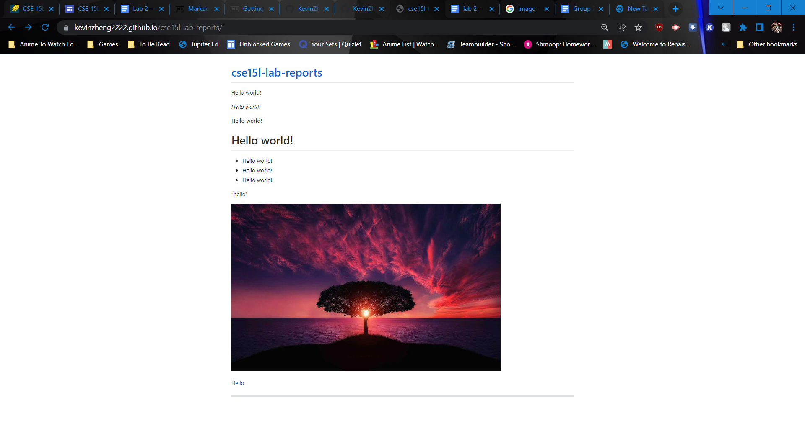

Hello world!

_Hello world!_

**Hello world!**

*Hel**lo wo**rld!*

__He*llo wor*ld!__

# Hello world!
* Hello world!
* Hello world!
* Hello world! 
> Hello world! 
"hello"
---
`Hello world!`
```
# code block 1
Hello world! 
*Hello world!*
> Hello world! 
```
```
# code block 2
ssh username@ieng6@ucsd.edu
Password:[]
```


[Hello](https://kevinzheng2222.github.io/cse15l-lab-reports/Hello.md)

[Hello again!](https://youtu.be/dQw4w9WgXcQ)




---
[Lab Report 1](https://kevinzheng2222.github.io/cse15l-lab-reports/Labreport1/lab-report-1-week-2)

[Lab Report 1](Labreport1/lab-report-1-week-2.html)

[Lab Report 2](https://kevinzheng2222.github.io/cse15l-lab-reports/Labreport2/lab-report-2-week-4)

[Lab Report 3](https://kevinzheng2222.github.io/cse15l-lab-reports/Labreport3/lab-report-3-week-6)

[Lab Report 4](https://kevinzheng2222.github.io/cse15l-lab-reports/Labreport4/lab-report-4-week-8)

[Lab Report 5](https://kevinzheng2222.github.io/cse15l-lab-reports/Labreport5/lab-report-5-week-10)