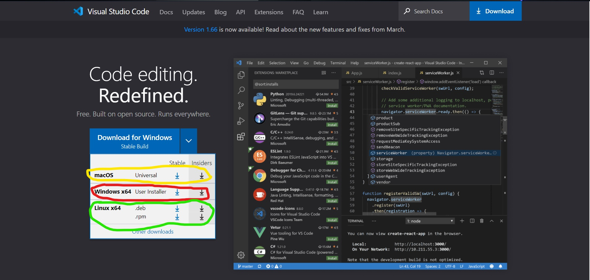
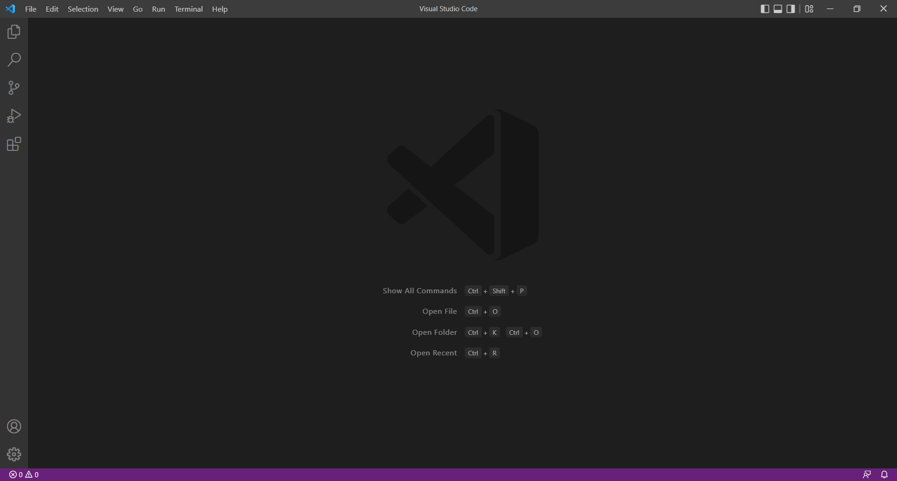

# Accessing your course-specific account on ieng6.

First to access your course-specific account on ieng6 easily, a IDE is needed, a good IDE to be used in this course is [Visual Studio Code](https://code.visualstudio.com/).

(HIghlighted in red is the Windows download, yellow Mac download, green Linux download)

VSCode should llok like this:

