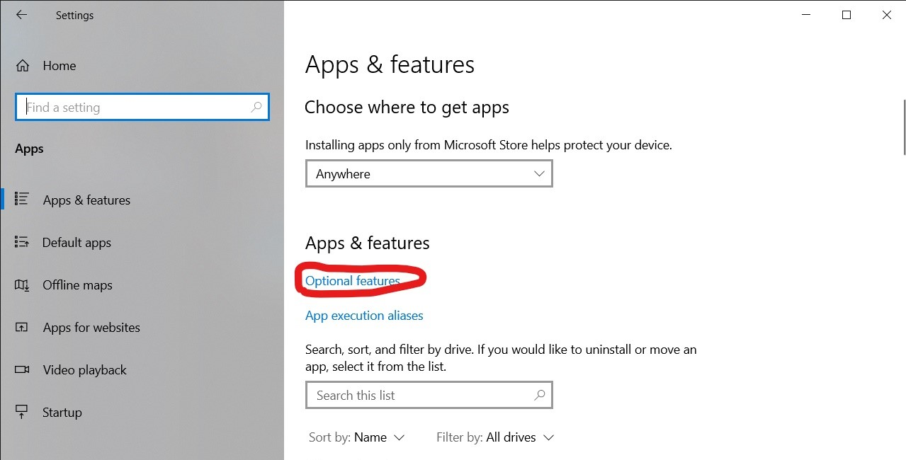
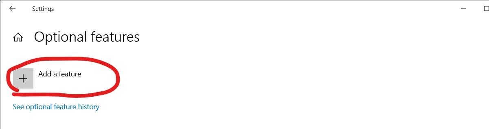
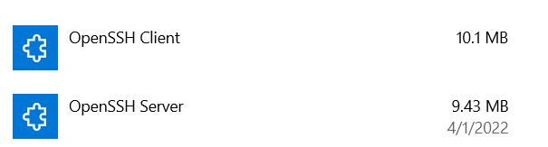
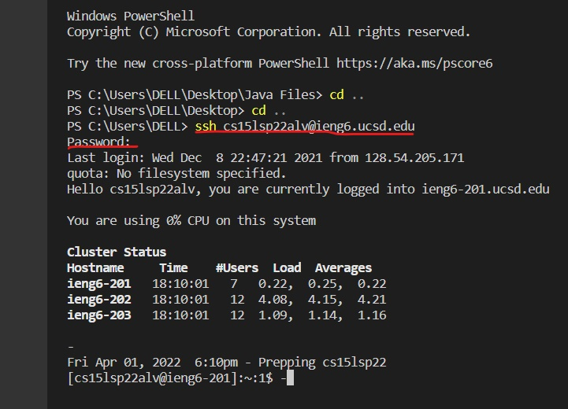
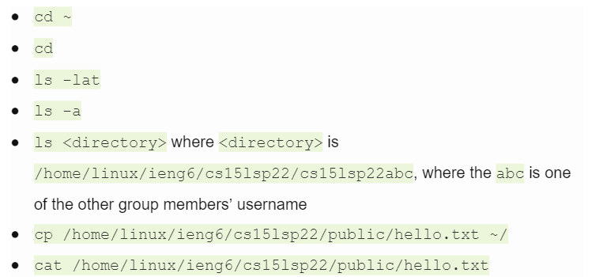
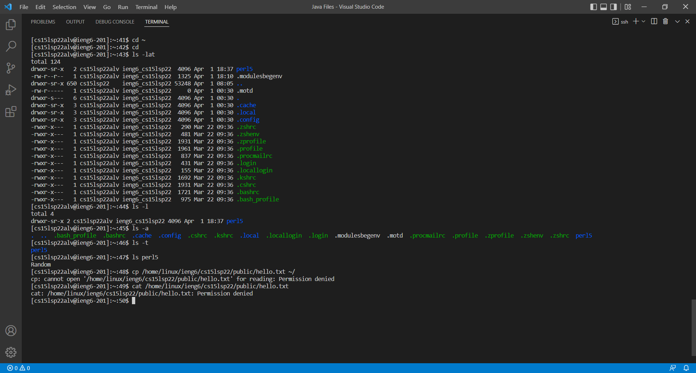

# Accessing your course-specific account on ieng6.

## Installing VScode
First to access your course-specific account on ieng6 easily, a IDE is needed. A good IDE that is useful in this course is [Visual Studio Code](https://code.visualstudio.com/).

(Circled in red is the Windows download, yellow Mac download, green Linux download)

VSCode should look like this:

## Remotely Connecting
Next step to use commands to access OpenSSH is to install both OpenSSH Client and OpenSSH Server if you are on windows.
These are the steps:
First go to the settings and go into Apps. Then next go into Apps and Features as indicated below:

Then next is to click to Add a feature:

Then finally is to search for this two, if they do dnot show up then it means you have it installed.

Finally to access remotely is to use the command line ssh (username)@(host). In this case is ssh (your username)@ieng6.ucsd.edu to access the remote server.

(Underlined in red is the command line to access remotely plus asking you for you password, and since its could be your first time accessing remotely, then another prompt will ask you for a yes/no, enter yes.)

## Trying Some Commands
Next is testing some commands, you can try these list of commands:

These commands should show the result as shown below:

