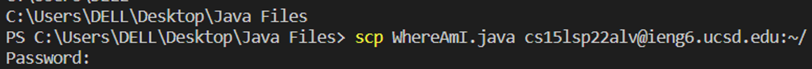
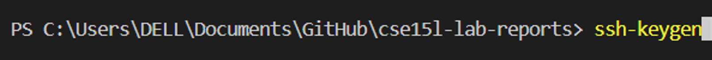
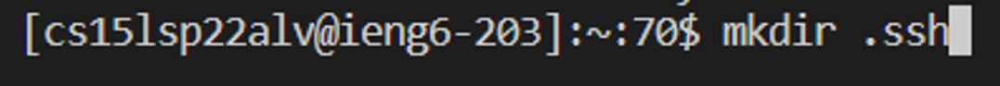
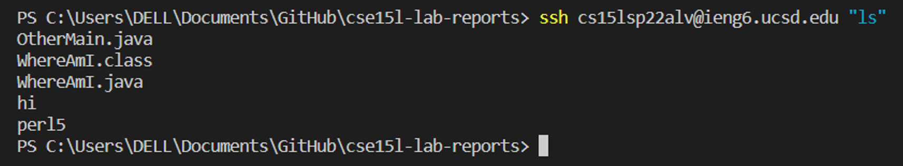

# Accessing your course-specific account on ieng6.

## Installing VScode
First to access your course-specific account on ieng6 easily, a IDE is needed. A good IDE that is useful in this course is [Visual Studio Code](https://code.visualstudio.com/).

(Circled in red is the Windows download, yellow Mac download, green Linux download)

VSCode should look like this:

## Remotely Connecting
Next step to use commands to access OpenSSH is to install both OpenSSH Client and OpenSSH Server if you are on windows.
These are the steps:
First go to the settings and go into Apps. Then next go into Apps and Features as indicated below:

Then next is to click to Add a feature:

Then finally is to search for this two, if they do not show up then it means you have it installed.

Finally to access remotely is to use the command line ssh (username)@(host) on the user terminal terminal. In this case is ssh (your username)@ieng6.ucsd.edu to access the remote server.

(Underlined in red is the command line to access remotely plus asking you for you password, and since its could be your first time accessing remotely, then another prompt will ask you for a yes/no, enter yes.)

## Trying Some Commands
Next is testing some commands, you can try these list of commands on your termonal:

These commands should show the result as shown below:

## Moving a File with scp
One way to move a file from local to the remote server is through typing this line of code scp (file) (username)@ieng6.ucsd.edu:~/ on the terminal. This line of code will prompt the user for their password to allow for the file to be copied and moved into the desired location.

## Setting an SSH Key
To allow a more smoother access into the remote server, creating a ssh Key is useful. To do so, go into your terminal and type in this line of code ssh-keygen to create a public and private key on your local device.

After that log into your ssh account and type this in the server to make a copy of your public key. What this does is that it uploads your public key onto your account so that you do not need a password to get into the remote server from your device with the key.

## Optimizing Remote Running
To make remote running more easier and smoother, you can add "" to the end of ssh (username)@ieng6.ucsd.edu to have ssh (username)@ieng6.ucsd.edu "". This allows you to make certain instructions in the quote to run on the remote server without having to log into the remote server itself.
This is shown below:

## Ending
With this it should help you understand how to log into your account on ieng6. and ways to make your usage of OpenSSH more smoother.