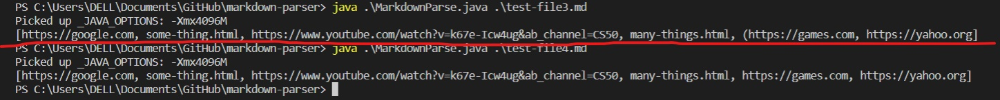

# Lab Report 2
### Code Change 1

[Test file 2](https://kevinzheng2222.github.io/cse15l-lab-reports/test-file3.md)

The reason for having this code added to our coding was because we added a test to see if the program will read a link with a space between ] and (. The program could read the link, however the program printed out the incorrect behaviour we wanted, the program was printing the link with the space. This incorrect behavior can be seen in the image above where it printed out the link https://yahoo.org. To fix symptom we first looked at the coding why it was printing the link, and we found that the original code did not have a condition to check for space. Thus we added a if statement to check for when there is a space, and when there is a space we skip that line and continue to the next line.

### Code Change 2

[Test file 3](https://kevinzheng2222.github.io/cse15l-lab-reports/test-file4.md)

For this code change we added a test to check if the program will read a link with a (( at the front of the link. The program could read it, however the program printed out the incorrect behaviour we wanted, the program was printing the link with the double (. This incorrect behavior can be seen in the image above where it printed out the link https://games.com (test is above the red line). To fix this symptom we first looked at the coding why it was printing the link, and we found that the original code did not have a condition to check for a double (. Thus we added a if statement to check for when there is a double (, and when there is a double ( we skip that line and continue to the next line.

### Code Change 3

[Test file 4](https://kevinzheng2222.github.io/cse15l-lab-reports/test-file2.md)

For the last code change we added a test to check if the program will read a link with a ]] at the front of the link. The program could read it, however the program printed out the incorrect behaviour we wanted, the program was printing the link with the double ]. This incorrect behavior can be seen in the image above where it printed out the link https://yahoo.org (test is below the red line). To fix this symptom we first looked at the coding why it was printing the link, and we found that the original code did not have a condition to check for a double ]. Thus we added a if statement to check for when there is a double ], and when there is a double ] we skip that line and continue to the next line.
